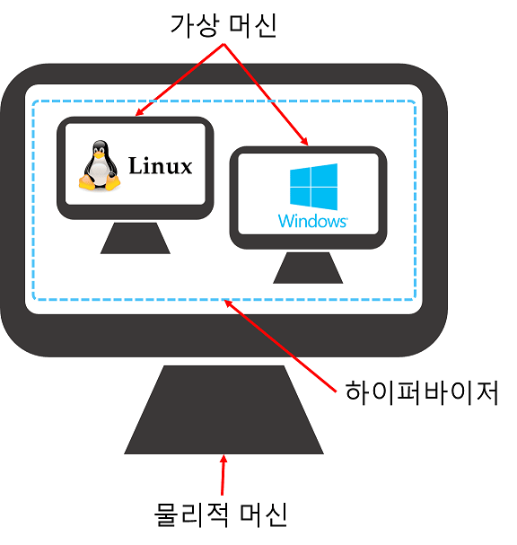

# Hypervisor란?

#### ✔ Hypervisor의 정의

**하이퍼바이저**의 위키백과 정의는 다음과 같습니다.

**하이퍼바이저**는 호스트 컴퓨터에서 다수의 운영 체제를 동시에 실행하기 위한 논리적 플랫폼을 말한다. 가상화 머신 모니터 또는 가상화 머신 매니저라고도 부른다.

쉽게 말하면 **하이퍼바이저는** 소프트웨어로, 하나의 컴퓨터에 설치하여 여러개의 컴퓨터처럼 사용할 수 있도록 해줍니다. 
**물리적 머신**을 다수의 **가상 머신**으로 분할할 수 있습니다. 각 **가상 머신**에 설치된 운영체제는 **게스트 OS**라고 부릅니다. 또한 하이퍼바이저가 실행되는 하드웨어는 **호스트 머신**이라고 부릅니다.

#### ✔ 하이퍼바이저의 타입 구분

하이퍼바이저는 두 가지 타입으로 나뉩니다.

- Type 1
: **네이티브** 또는 **베어메탈 하이퍼바이저**
하드웨어에 직접 설치되어 하드웨어를 게스트 OS를 설치할 수 있는 여러 개의 가상 머신으로 분할해줍니다.
RAM 용량 초과/동적 할당을 **지원**합니다.

- Type 2
: **호스트 하이퍼바이저**
호스트 운영체제 내에 설치되어 하이퍼바이저 관리 콘솔이 필요하지 않다는 장점이 있습니다.
RAM 용량 초과/동적 할당을 **지원하지 않아서** 가상 머신 리소스 할당에 주의해야 합니다.

----------------------------------------

### [홈으로](README.md)

### [Hyperviser란?](HYPERVISOR.md)

### MarkDown이란?