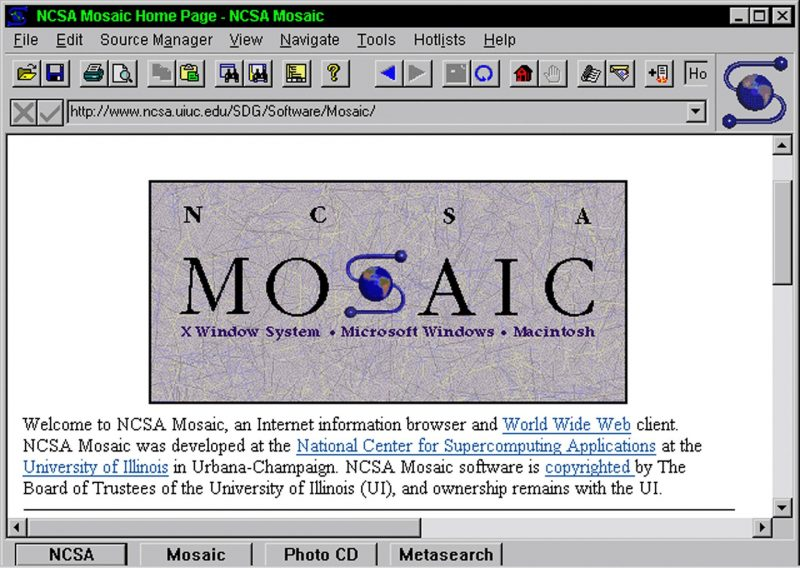

### [Index](README.md)

### [Posts](../POSTS.md)

----------------------

# 웹기술의 등장 과정
   
웹기술의 등장 과정에 대해 알아 보겠습니다.

**1. 어느 단체의 누가 어떤 목적으로 웹 기술을 만들었는지?**

인터넷은 1960년대에 미국 국방부 산하의 고등 연구국에서 군사적인 목적으로 처음 개발되었다. 하지만 우리가 흔히 "인터넷" 이라고 하면 떠올리는 각종 웹사이트 등의 시초는 바로 1990년대 팀 버너스 리가 개발한 월드 와이드 웹(World Wide Web)이다. 팀 버너스는 1989년 월드 와이드 웹의 하이퍼텍스트 시스템을 고안하여 개발했다. 최초로 그림을 텍스트와 표시해주는 인터넷 브라우저인 Mosaic가 1993년에 나왔다.

**2. 웹 기술의 처음 목적과 지금 활용되는 상황이 어떻게 다른지?**

웹 기술은 세계의 여러 대학과 연구기관에서 일하는 물리학자들 상호간의 신속한 정보교환과 공동연구를 위한 프로그램으로 고안되었다. 문자나 사진, 동영상, 음성 등이 조합된 데이터베이스인 사이트의 정보를 전용 열람용 소프트웨어인 웹 브라우저를 통해 입수한다. 

현재의 인터넷은 학자간 정보 교환의 의미를 초월하여 문화와 상업에 막대한 영향을 미쳤다. 이는 email, 메신저, VoIP 전화, 화상 통화뿐 아니라, 블로그, 소셜 네트워크, 온라인 쇼핑 사이트, 게임 등 전 세계를 하나로 묶는 기술이 되었다.

